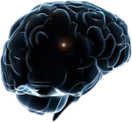
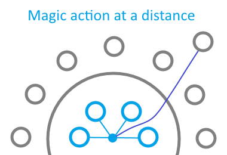
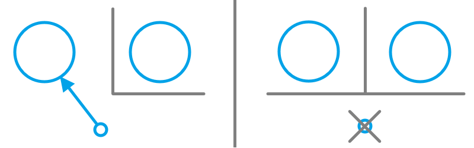
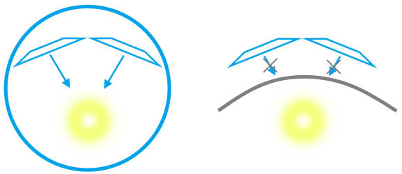
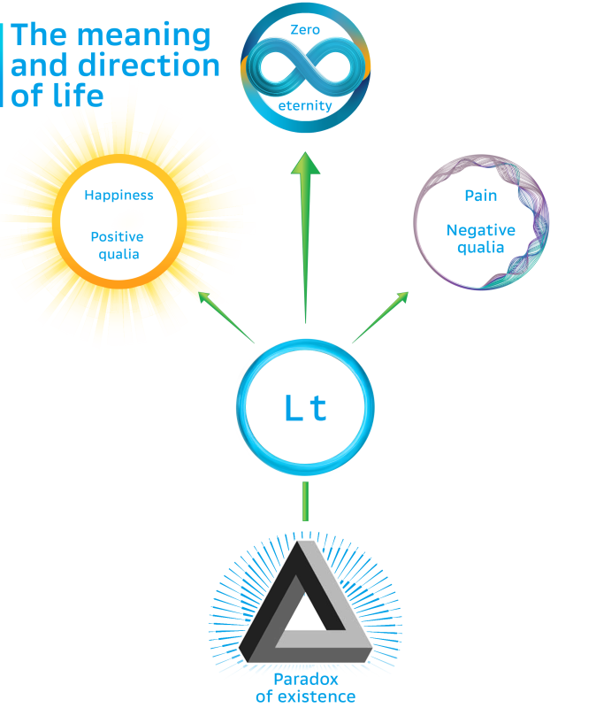

# LT theory of phenomenal consciousness | Survival

Lt is a particle that acts as a subject, the so-called observer in the brain, with the following functions:
1) Perception (Qualia): Visuals, sounds, pain, and other sensations
2) Attachment to the organism
3) Reverse influence on the brain

The lt remains in the brain after its death.  
Phenomenal consciousness is the sum of sensations/qualia. Other brain functions are not part of phenomenal consciousness.

## Part 1. Survival
Necessity of cryonics

### Lt's existence

To the question of what happens after death, another question arises: what was there before birth?
The particles that make up the body existed before birth and will continue to exist after death.
There is no magic in either birth or death that destroys or creates particles.

Even during life, many of the body's cells and particles are replaced.
The body can undergo a kidney transplant and continue to live.
With partial brain damage or the removal of certain parts, life continues as well.
Bones are replaced over a period of 10 years, the liver renews itself over several years, the heart is replaced halfway during a lifetime, the retina does not regenerate, and brain cells are partially replaced.

If cells were fully replaced, it would imply death.
If nothing from the body remains from when one was a child, then that body has been destroyed and died, and what exists now is a different one.
If the particles that made up the child were gathered again, one might assume that this would be you, not the one in the current body, but this is not the case.
A complete replacement of the brain would mean that at some point during life you would stop feeling anything, and there would be a different carrier of consciousness.
Therefore, something remains - a certain central or core particle in the brain, which is the so-called observer (lt).
You are real "yourself" in the brain, particle that feels - the so-called observer (lt).
The brain is not an indivisible object; it is made up of indivisible particles.
What are you in the brain? Answer: the carrier of consciousness can only be a single indivisible particle.
It is not possible to choose multiple particles, as they are separate particles.
This means that in the brain, any particle can be replaced with an identical one, and you wouldn't notice a difference, but if the central particle is replaced, your "self," being removed from the brain, would cease to feel anything.
The lt is indivisible. If we assume that the lt consists of several particles, then, just like with an organism, the division could continue, and the other particles would be external to the lt.

The highest electrical activity in the brain occurs in the reticular formation (which persists even during sleep).
The reticular formation is one of the ancient part of the brain from an evolutionary point of view.
The central part of the brain is either the reticular formation, the periaqueductal gray matter (where streams from other areas converge), or another adjacent region.
Without the brain's electrical activity, a person feels nothing.
Qualia cannot be explained or expressed through anything else, which means it is something fundamental.
If the lt does not exist, then there is nothing that feels, nothing for the signals to converge on as a unified formed representation of the world (qualia from the eye and other sense organs), the binding problem arises.
The lt can be described as a particle capable of qualia - this is its property, fundamentally distinct from the rest of the world, and this is life: a living particle (life+particle - lt).

To the question of whether there can be another life after death - the answer is: if there is nothingness after death, then that same nothingness has already existed before birth.
The state of death of the lt before birth is no different from the state of death after the destruction of the organism.
The lt had already experienced a state of death prior to their birth, and yet they were born.
What prevents the particles from assembling again in another form or similarly?
Physical laws do not prohibit what has already happened according to these very same physical laws.
In nature, there is a phenomenon known as the cycle of carbon and other elements.
The possibility of being born a first time means the possibility of being born a second time.
And the fundamental impossibility of being born a second time logically implies the impossibility of being born even once, if there is no mechanism to distinguish one unique occurrence from another.

---

### Moment of death

For a person, death occurs at the moment of loss of consciousness, but even after this moment, a person can still be resuscitated.
Death is currently considered to be the destruction of brain cells due to a lack of oxygen.
However, destruction is merely the movement of atoms, not instantaneous, and theoretically reversible.
Particles continue to remain in the brain.
If we consider the moment of loss of consciousness, a person can feel nothing during sleep or fainting as well.
Theoretically, recovery is possible from any level (not referring to technical feasibility at this time).
One might assume that death is the separation of surrounding atoms from the lt, but for whom or for what, and why should that be considered death?
If in a religious sense there are angels, what happens if no one comes? But there is no reason to believe such angels exist.
If we are in a virtual reality, then the computer in the base reality must oversee this, but what if it doesn't?
But in base reality, we could question - are we in a virtual reality?
What makes this question lead nowhere and be meaningless.
This means there is no physical moment of death.
Death is the disintegration of the organism.
What the organism consists of continues to exist in the world.
The lt can find itself in a new organism.
Then after death, a new life is possible.

---

The idea of the lt implies that reverse transplantation is possible.
If physical laws allow it, the lt can be taken from a dying organism and placed into another one, and its life will continue.
This provides an unlimited lifespan.

It is possible that life for the lt happens once every million, or even billion, years.
The longer the time, the greater the chance of being born again.
But there is a huge problem - there remains the possibility of pain and unhappiness.

---

### Future

What will life be like in the future in terms of happiness and unhappiness? In what kind of world could the next life exist?

Technological and intellectual development could create a wonderful world.
And it would be wonderful, if not for the possible problems.
But what if the world descends into an unbeatable fascism?
Or if robots destroy the world and construct hell, either accidentally or intentionally.
Such robots could endlessly grow humans in incubators and inflict pain on them.
On the planet, there are already species evolving in relation to each other - one species changes to efficiently eat the other, while the other evolves to protect itself from being eaten.
This is hell.
It is unlikely that after the emergence of intelligent life, evolution will lead to its re-emergence again from scratch.
Humans with technology will be able to modify other species so they no longer engage in the struggle for survival, so one species does not eat another.
To end the suffering of other species, to stop the existing hell for those who experience it, so that being born as another species would not evoke fear.
Even if humanity goes extinct, other species could evolve over millions of years, with the exception of the complete destruction of life conditions on the planet.
Therefore, it is unlikely that the next life will follow the evolutionary path; most likely, it will either be a constructed paradise or a constructed hell.

A world in a state of hell is a world of non-freedom. A world in a state of paradise is a world of freedom.
This line of reasoning suggests that freedom allows one to leave paradise for hell, but leaving hell is impossible.
One could attempt to explain to robots that life is a distinct form of matter, whose laws are of primary importance.
However, there is no reason why robots would be obligated to follow these laws.  
Such hell could persist until the destruction of the environment.
This is billions of years, if robots do not relocate to another planet when this one is destroyed by the sun, or until matter decays or the universe collapses, if the universe is cyclical.

In the future, an organization might be established to prevent a descent into a non-free hell.
A virtual reality could be constructed where, in the base reality, people are confined to virtual reality with no means of escape. And within the virtual reality, there is freedom and paradise.
This is a combination of freedom and non-freedom - a paradise that cannot be left. Such a paradise could be stable.
And in the event of the sun's death, the population could simply be transferred to another planet, possibly even automatically.

---

But there may also be another external factor - alien life.

The possibility that aliens could be hostile requires the development of the most powerful weapons, even during peaceful times.
The most powerful weapon would be self-replicating robots that travel to neighboring planets and create copies of themselves.
The speed of their spread increases geometrically, and in a million years, they could completely colonize the galaxy.
These robots would not necessarily attack alien life; their purpose could be defensive. Such robots could restrict the development of alien life.
Aliens could also create such robots, but theirs might be offensive.
Humans might think: if aliens can create such a weapon, then humans should create it too.
Aliens might think the same: if another form of life can create such a weapon, then we must create it for defense.
And if we start creating them now, it still might not be enough.
Enemy robots could outnumber ours, and aliens could use such weapons to destroy life on our planet.
If physics allows for a superluminal drive, then such robots likely do not yet exist; otherwise, they would already be here.
Even if life did not originate on another planet in this galaxy, it might have originated in a neighboring one.
This risk might mean that humans should fill this galaxy and neighboring galaxies with robots.
But this could leave alien life in a locked state if humanity goes extinct, potentially leading to the creation of offensive systems.

---

What if the universe in the future can no longer sustain life or generate qualia for the lt?

One of such variants is the variant of dark energy, in which in the distant future dark energy will start expanding space more and more strongly, and so strongly that atomic structures will no longer be able to hold themselves together. 
It is a time when life will no longer be possible, and the universe will enter eternal expansion.

Since there is no such electronic activity around the lt after death as there is in the brain, nothing is felt after death, and the next life begins instantly. Even if millions of years have passed.
If nothing is felt, then this time effectively does not exist for you.
Even during life, the flow of time can feel slower or faster, while in dreamless sleep, time passes instantly.

If the next life never begins, and the universe has entered eternal expansion, what do you experience? Infinity multiplied by zero?
An infinity passing instantly? This is impossible; time would still remain.
This leads to a paradox, and therefore a mystery.
At the same time, there is no moment where one could definitively say that the situation has closed and some change must have occurred.

If dark energy and the universe go through cycles of expansion and contraction, then the next life will inevitably begin.
And the paradox is not encountered.

The mystery seems unsolvable, and it is unclear whether any discoveries in physics will help resolve it.

---

4 possibilities after death:
1) A constructed hell
2) A constructed paradise
3) Birth along the evolutionary path, between paradise and hell
4) The paradox of "zero eternity"

Only possible discoveries in physics could exclude the scenario of zero eternity. And even then, only if the universe undergoes cyclical stages of expansion and contraction, and physics can detect this.

Therefore, the future after death is highly unclear and ambiguous; it represents a great uncertainty, which also makes our life more valuable.

---

### What's cryonics? 

Cryonics is a technology for freezing an organism to -196 degrees Celsius in a capsule.
After freezing, this allows the organism to be preserved in its original form for hundreds of years.

If we look back - 200 years ago, technology was far less advanced, and 500 years ago, the difference was even greater.
The same kind of progress will happen 200 years from now - future technologies will be highly advanced, and what about 500 years from now?
Technology is limited only by the laws of physics. For example, a doctor cannot be instantly transported from Saturn - movement itself is limited by speed.  
This is a opportunity.  
And potentially a possibility for a life without a time limit, due to possible future life-extension technologies.  
And when a person dies, they should be cryopreserved, not buried or cremated, scattering their main particle - the carrier of consciousness - anywhere.
Cryonics centers should exist in cities.
In the event of an animal's death, if there is no cryonics center in the city, it can be frozen for later transport to another city.
Within a week, neuronal degradation will not cause any displacement; the brain will remain sealed.

And you wouldn't want to be born, or have your relatives be born, as a grasshopper or something worse.
Lt does not choose who to be born as and it does not retain memory, it does not have such functions.
If there were certainty about the positivity of the next life, there would be no need to worry about it so much.
Denying cryonics to the deceased is a rejection of a life lasting hundreds of years in favor of vast uncertainty.
Cryonics becomes a moral obligation.

---

### Structure

Structurally, consciousness in the brain consists of:
1) A functional part of the brain without perception/sensations/qualia/phenomenal consciousness, includes memory
2) Phenomenal consciousness - the sum of qualia
3) Qualia includes the sense of "self"
4) Lt - the real "self"

The integrity of the brain in cryonics may, perhaps, be secondary.
Only the brain’s hermeticity is important.
The question is whether the lt can be found and what it actually is.
It could be a form of dark matter or something entirely unknown.
If there are many lts in the brain, it may be impossible to determine which one was primary and alive (the others may have been inactive).

---

### Could there be another answer?

Can answers be found in religion?

Religious organizations will not answer the questions raised in the article - they show no interest, do not discuss, and do not research such ideas.
The mere fact that they have no connection to telescopes and no calls to research the world using them is enough to reduce their opinions to zero.
They are not interested in the world and science; they are only interested in their cult.
The fact that the moment of death does not exist also invalidates the concept of a religious paradise.

---

### Verdict

This concept of phenomenal consciousness does not contradict the laws of physics.
If it is accepted as correct, there will be no reason to think otherwise.
Once adopted, society will not deviate from it.
Only discoveries in the field of physics can refine this concept.
The lt must have physical properties; otherwise, it could not maintain its position during motion.
And in the future, scientists may be able to come closer to the mystery of consciousness and the question of the central particle, and answer the questions posed in the theory.

At one time, people struggled to understand the motion of planets, and there were various ideas. When the correct understanding of their motion was established, other ideas fell away as less accurate.
It is unclear why the idea of the lt did not become the main focus earlier. It is simpler, and in some ways, even more banal, in contrast to the absurd notion of flying angels and a religious paradise.
The human body is made of something, then that something does not disappear after death and existed before birth.
If you, as a lt, did not exist before your birth, then no matter what happened in the world, you could not have come to exist in it.
It is as important to know the theory as it is to know what happens after death and to understand the importance of survival.

In our time, cryonics should become the primary approach in matters of death.  
Regardless of life extension technologies.
First survival, then research.  
The lack of proof is not a reason to abandon survival.
The less time someone has left, the more critical it becomes - this is the time needed to prepare the cryochamber.

Death can be defeated.

In memory of J.

---

## Part 2. Cryonics

**Economic problem**

The cost of human cryopreservation services in the United States in 2024 ranges from $25,000 to $115,000, while for animals, it is between $5,100 and $132,400.
The price depends on whether only the head or the entire body is preserved.
In major cities, many people can afford this.

For those without sufficient funds, the following solutions exist:

P2P (Peer-to-Peer)  
Peer-to-peer (P2P) systems allow individuals to fund their cryopreservation through donations from family, friends, or online networks.
These direct financial contributions provide a more flexible and personal way to raise money, relying on social connections and crowdfunding platforms to gather the necessary funds.

B2C (Business-to-Consumer)  
Cryonics companies offer membership fees and extended insurance covering part of the costs.
Banks may introduce financial products allowing family members to act as guarantors, making cryopreservation more accessible.

B2G (Business-to-Government)  
Government programs could support body preservation.
With a paradigm shift in the perception of death, cryopreservation costs could be included in healthcare systems.

Donor Programs  
Donation-based programs can help make cryopreservation more accessible for those without sufficient funds.
Charitable organizations, crowdfunding efforts, or non-profits can play a role in subsidizing the costs.
These organizations may collaborate with cryonics companies to provide financial assistance to individuals who cannot afford the full cost of cryopreservation.

**Actions upon death**

If the organism was not brought to a cryocenter before death, the body must be positioned straight upon death within half an hour. In the case of limbs, they should be tucked in; ears should be pressed to the head, bandage the paws and ears.
If there is no cryocenter nearby, the organism must be prepared for transportation:
1) Wrap the organism in cloth. Place it in a plastic bag
2) If there are no more than a few days before transfer to the cryocenter, place the organism in a refrigerator at a temperature of 2 degrees, but not lower than 1 degree, to avoid the formation of ice crystals
3) If the transfer will take longer than a day, purchase dry ice (read the safety instructions)
4) If the container is not thermally insulated, apply insulation tape to the inside, you can use a bath
5) Dry ice pellets must be smaller to avoid exerting pressure on the organism and to ensure even cooling
6) Surround the organism with dry ice inside the container
7) Check the dry ice daily and replenish it if necessary
8) If dry ice is unavailable, place the organism in a freezer below 0°C at the lowest possible temperature

**Dry ice**

When handling dry ice, safety precautions must be followed:  
Do not touch without protective gloves; with gloves, no longer than a few seconds, since the temperature of dry ice is -78°C.  
Keep the room ventilated to prevent CO2 from accumulating and displacing oxygen.  
When transporting it in a vehicle, the container should be placed in the trunk, windows should be slightly open, and delivery is recommended.  
Dry ice must not be placed in an airtight container.  
Dry ice should only be disposed of in a well-ventilated area or an open outdoor space, do not dispose by pouring water over it.

---

## Part 3. Verification

**Experimental methods**

Experimental methods for confirming the theory in the research of the brain:
1) Signal flows for qualia must converge on a single particle
2) The effect of the lt and information about qualia on the brain
3) The lt must not be replaced by something else throughout life

The theory is a direct consequence of the organism's structure.
In researching the brain, one must start from the principle of maximum divisibility, meaning that the brain consists of indivisible particles and that the carrier of consciousness is located somewhere in the brain (see the section on the necessity of the carrier of consciousness).
To disprove the theory, it is necessary, for example, to prove: 
that the streams for qualia do not converge on a single particle; that the influence of qualia on the brain is absent; that there are no particles remaining throughout life;
that particles disappear at death; if we are in virtual reality; that the moment of death exists and undiscovered angels really arrive.
The law of conservation of energy and the circulation of particles in nature lead to the main idea of the theory - the possibility of a next birth.
To refute this idea, it is necessary to refute either the law of conservation of energy or the circulation of particles.
The question: what happens if the brain's particles end up in different brains of other organisms, leads to the idea of the consciousness carrier as a single particle.

**Research path**

The following steps must be carried out for research:
1) Identify the minimally required active brain regions for consciousness (neurobiologists have already identified several candidates)
2) Research of the flows of visual signals, primarily in the zones identified by neurobiologists
3) Determination of the place where the signals converge
4) Research of how information is transferred to the quantum level; this will confirm the existence of phenomenal consciousness and will make it possible to determine the exact formulas of qualia
5) Research random quantum processes associated with qualia; this will make it possible to determine information coming from qualia and how reverse influence of qualia affects the brain
6) Researching the reverse influence will make it possible to determine how exactly phenomenal consciousness became entrenched in evolution
7) Identify a shared node for vision and hearing, which is activated without vision and sound
8) Assess whether particles in this node are replaced during life to exclude lt candidates
9) Determination of how exactly the brain sets the frame rate of consciousness and collapses
10) Depending on the structure, this may help determine the location of the lt
11) Removing particles from the central node can show whether this changes reverse influence in the form of random processes
12) Further help may be provided by researching the coding of the node structure in DNA
13) Researching the node in other species, a different type of node may show a difference that allows to exclude inappropriate particles
14) Determine the exact properties of the lt via quantum interactions

**Orch OR theory**

The Orch OR theory of consciousness (Orchestrated Objective Reduction) by Penrose and Hameroff coincides with the lt theory in several aspects:
1) Phenomenal consciousness is not located in neurons, but is related to quantum phenomena
2) The second method of generating qualia
3) A solution to the problem of pointwise binding (the issue is discussed in the section on the connection between qualia and the brain)
4) A solution to the problem of the speed of time (the issue is discussed in the section on the connection between qualia and the brain)
5) Solving qualia size (the issue is discussed in the section on the connection between qualia and the brain)

Supporters of the quantum theory also include Federico Faggin and Giacomo Mauro D'Ariano.

**CEMI theory**

The electromagnetic conscious CEMI theory (Conscious Electromagnetic Information) makes certain correspondences/similarities with the lt theory:
1) Phenomenal consciousness is not located in neurons
2) The 3rd method of generating qualia
3) Solving qualia size (the issue is discussed in the section on the connection between qualia and the brain)

**Fundamentality**

There are two options when it comes to the fundamental nature of qualia and its uniqueness as a phenomenon:  
1) Not fundamental - it is possibly explained through other phenomena.
2) Fundamental - it cannot be explained through other phenomena.

Trying to prove fundamentality means proving that explanation is impossible and that no other phenomenon exists that could make qualia non-unique.
To prove non-fundamentality, it is enough to provide an example of a phenomenon from which qualia may consist; that is, the starting point is fundamentality.
The search for an example of an entity is behind those who wish to attempt to prove that qualia are not fundamental and not unique.  
In the case of fundamentality, it is impossible to find such an example and prove non-fundamentality.
If we assume that emergence (the presence of properties in a system that are not inherent in its individual components) can create qualia, signals in the brain must still converge at a single particle via the method of generating qualia; otherwise, a binding problem arises, which makes the question of emergence meaningless.  
  
The properties of emergence can be obtained by modeling, for example: knowing the properties of a water molecule, by modeling a multitude of molecules, we can obtain the properties of water.  
According to the special theory of relativity, an event at one point cannot cause an instantaneous result at another point, and "now" occurs only at a local reference point.
According to the principle of locality and the special theory of relativity, a visual image could at most consist of several points.  
  
The simultaneous display of millions of points of a visual image violates the principle of locality, which means that phenomenal consciousness is not constrained by the special theory of relativity; this relates to the problem of pointwise binding.
It is impossible to derive anything that violates the special theory of relativity from something that obeys it.  
The problem of pointwise binding requires a separate physical law, which also implies the fundamentality of qualia (the issue is discussed in the section on the connection between qualia and the brain).  
  

If we find a neuron that contains information about a red color point, then the question arises: why does this result in the experience of red, and without introducing qualia as a distinct phenomenon, this cannot be resolved.  
The fact that the brain is divided into regions and that they influence the generation of qualia, does not contradict the existence of signal convergence for qualia into a central point, the absence of which leads to the binding problem.
No separation of qualia across different parts of the brain was found.
The functional part of the brain relates to the "easy problem of consciousness"/"access consciousness".
To say that qualia, as a separate phenomenon, do not exist and are merely based on information is equivalent in meaning to the idea that the processor displays information without a monitor.  
The image information before the blind spot is filled in is not reflected in phenomenal consciousness.
This means that only part of the brain's information enters phenomenal consciousness, and shows that the information itself is not phenomenal consciousness.  
The absence of qualia would mean that a person has no visual image, no sound, no pain, and the organism functions without phenomenal consciousness.
Qualia are not something separate, they are connected to the carrier of consciousness.  
In informational theories there are no qualia and no bearer of consciousness to which they are directed, they do not solve the problem of pointwise binding.
The formation of a qualia-based image from spatially distributed information would violate the principle of locality and physical laws, and imply magical action at a distance.
Qualia have spatial size, information does not have such a parameter.
If we assume that there is qualia in information, then we add a hidden property that would be impossible to know about without the assumption of this hidden property.
Informational theories attempting to explain phenomenal consciousness do not answer the question of why you live in this brain and not in another; this requires a physical connection with the brain, and a physical connection requires a physical object.  
Qualia without the so-called observer lead to the same problem - why do you live the life of this brain and not another?  
  
The absence of the so-called observer leads to the problem of temporal binding, which raises the question of why qualia from the past continue to be experienced in the future.
The question includes both movement in space on a moving planet and connections between frames of phenomenal consciousness, including sleep and anesthesia.  
  
To say that the particle lt, which is the carrier of consciousness, the so-called observer, cannot exist is equivalent to saying that there is no carrier of consciousness in the collection of particles forming the brain.  
The idea of the emergence of the carrier of consciousness has problems: there will be a contradiction if some particle is replaced.
If two brains have two identical emergent carriers of consciousness, then again we come to the problem of choosing the brain.
If the particles are replaced with others with the same emergence, the carrier of consciousness will stop receiving qualia, which contradicts the idea of emergence.
Emergence is about properties that can be obtained through modeling. Identity to the carrier of consciousness is not about properties, but about what the carrier physically is.
The ability to create an identity implies the possibility of creating an identical one, which means no difference exists between them and leads to the problem of how the brain selects between them.
The uniqueness of the lt is fundamental, cannot be artificially generated, and is analogous to the no-cloning theorem.
Without uniqueness, there would be no connection with the current brain, just as there is no connection with another brain that is not one’s own.  
Qualia have a parameter of location relative to a reference point in space, where the center is located at the consciousness bearer.  
  
To say that particles with qualia properties do not exist is to say that the organism is not consist of particles, or qualia do not exist, or are not connected with particles.
The organism consists of particles, and the phenomenon of qualia exists; one must be connected with the other. The theory does not introduce anything new, but connects one with the other.  
The philosophical term "indivisibility of consciousness" is explained by the indivisible so-called observer, the bearer of consciousness, the lt.
The fundamentality of qualia means that the ability to experience qualia is also fundamental.
And it means that the physical phenomena with which qualia is associated are also fundamental, and this is quantum mechanics.  
Quantum indeterminacy is fundamental and cannot be replicated informationally.  
To say that qualia can be replicated informationally is equivalent in meaning to the idea that quantum indeterminacy can be replicated informationally.   
The statement that since qualia is immeasurable, and therefore does not exist and cannot influence physical processes, contradicts quantum mechanics.
The no-cloning theorem (that a quantum state cannot be copied) shows that a quantum system cannot be fully measured, but a quantum system affects physical processes (measurement destroys the quantum state and extracts only part of the information).
Quantum entanglement and randomness are not directly measurable, entanglement is not directly observable, randomness has no hidden parameters.
The visual image includes information about the points of the visual image. The pain felt in the leg includes the coordinates of the location of the pain.
It is impossible for information to exist in a phenomenon, but for the phenomenon to not exist (we are talking about the information itself, not about its content).
The possibility of deriving the laws of quantum mechanics also cancels the assumption of the non-existence of qualia (on the interpretation of quantum mechanics in the section on the connection of qualia with the brain).
To say that qualia appeared evolutionarily is the same as saying that metal in the body was created for the organism evolutionarily.
In fact, it is the opposite - metal as a tool was used in the process of evolution in construction.
"The hard problem of consciousness" and the "explanatory gap" arose from the inability to explain qualia through other phenomena.

**Theory example**

We can use the example of a car.
A car moves without an external force - based on this, we develop a theory about the existence of an engine.
Knowing the law of energy conservation, we assume that the engine requires energy.
Knowing atoms and that a single atom cannot perform this function, we assume that the engine consists of many atoms.
Knowing the car's weight, we can estimate its energy consumption at a given speed.
From the maximum speed or acceleration, we can roughly estimate the engine's power.
From the sound, we can infer the engine type.
What would disprove the engine theory?
A contradiction of what is already known - such as a violation of the law of energy conservation or the idea that the car moves by magic.

**Proof problem**

Dark matter is presumed to exist, despite the lack of direct detection.  
The problem in the case of the lt is that the properties of qualia cannot be detected directly; only indirect detection is possible.
It is problematic to prove the existence of another fundamental phenomenon.
This is known from the position of the lt itself - the very sensation of visual information without the sensation of "yourself" is only possible if the sensation and the so-called observer exist.  
Detection of the lt will lead to the question: how to understand that it has the property of qualia and that it is a lt?  
Since qualia is based on quantum information, qualia cannot be directly detected.
The simultaneity of frames also adds to the detection problem.
Experiments in quantum physics take place in an isolated environment and it is unknown whether qualia exists in them, unlike in the brain environment.
To understand this, it is necessary to research the convergence of signals for qualia and the transition of information to the quantum level, as well as to research the feedback in the form of collapse.
This is the only way to research qualia and solve the "hard problem of consciousness."
A possible method might be to scan the central part of the brain in detail or to research how DNA shapes the brain.
Reasons why there are grounds to consider the lt as existing:
1) Solution to the question of non-being before birth
2) Solution to the question of living in this brain and not another
3) If we assume that the signals of sound and visual image converge on different particles, then either one or the other would be perceived
4) If we assume that there is no particle, then the carrier of consciousness is the generator of qualia; the multitude of particles leads to the problem that these are separate particles
5) Solution to the question of brain replacement by particles
6) The problem of temporal binding - why qualia from the past continue to be felt in the future
7) The fundamentality of qualia points to the fundamentality of the property of experiencing qualia, which cannot be emergent or composite and is a property of an indivisible particle
8) The problem of pointwise binding, size and reverse influence of qualia are related to quantum laws, which in itself points to a particle

The theory of phenomenal consciousness must answer these questions, and you can arrive at the lt model in different ways by answering these questions.
Departure from this model leads to contradictions and a lack of answers to these questions.
If we assume that if we collect the particles of the disintegrated brain back and this returns the phenomenal consciousness and the so-called observer, then it is a matter of particles, and if it does not return, then it is not a matter of particles and something else that was attached to the organism during life did not return.
Attachment to an organism is a physical interaction, the assumption of non-return of something physical to the idea of particles returning back is self-contradictory.

---

## Part 4. Qualia-brain connection

**Pointwise binding problem**

The binding problem means that signals for qualia must converge on a single particle.
If the signals do not converge but are located close to each other at the atomic level, then they are not bound.
The visual information from the eye - it has a left part and a right part, and they seem to be separate, but if they were truly separate, we would again face the binding problem.
This can be called the problem of pointwise binding.
The problem concerns both the binding of qualia to each other and their binding to the lt.
Introducing the particle, the receiver of qualia, does not create a new problem of how it receives signals - the problem already exists with qualia even without the particle.
Quantum entanglement solves this.

**Qualia methods**

1) It can be imagined that electrical activity near the lt serves as a generator.
The visual image from the eye, in terms of the amount of information, not only has an enormous size in megapixels and megabytes, but also has depth and brightness.
To generate the image, signals must transmit information at a megabit speed.
This creates a simultaneity problem; the time of the event must also be transmitted, and the method is not the same in the reverse direction of time.
This contradicts the fact that an atom cannot store a lot of different information, however in this case a law of qualia is assumed that allows to bypass this.
It does not resolve the speed issue and leads to the overlap of qualia.
It is not realistic and is provided only as an example of a search.

2) Particles are quantum entangled with each other, the electrical activity around them creates qualia in them, which is felt by the lt connected to them.
The method corresponds to the Orch OR theory (Orchestrated Objective Reduction) by Penrose and Hameroff.
In Orch OR, the issue of speed is addressed through frames caused by the collapse of the wave function.
The method is the main option under consideration.

3) Field.
For generation, it must transfer information to the quantum level.
The method corresponds to the CEMI theory.
The method is not a generator and can only be considered as an intermediate stage.

**Qualia size**

The minimum size of qualia in an image - the smaller the size of a point in the image, the more points are needed to generate it.
This means that the image point has a size.
This may imply that qualia appears to contain more information than what is used for the generation itself.
A circle has more information than a point with a radius.
The transition can be resolved by the wave function.
Part of the image may have the form of a volume of an object, and individual points of the image are linked to the volumetric form.
Some qualia are connected to others. This indicates a complex structure of qualia and its generation.
Other qualia also have a size parameter; for example, pain has one.
The size and the coordinate of qualia are parameters of the same order.

**Speed of time**

The speed of the passage of time cannot be set for sensations, as the speed of time is common for them and cannot be different at the same time.
However, if it is set by a separate signal, then without the signal, the speed is not chosen.
Time in qualia would lead to its overlapping.
There remains an option where speed is set by the number of frames, a method used in quantum theory Orch OR.
If the frames of the image and sound were separate, it would lead to flickering of both the image and the sound.
But this appears as a violation of continuity.
Smoothness in the passage of time occurs either by an instantaneous skip of time without qualia, or by a separate method.
To remove information from a superposition, a collapse is required; in order for some qualia not to exist in the next second, collapse is a necessary condition.
Reasons why qualia might be thought to occur at the moment of collapse, rather than the quantum state itself:
1) There would be temporal flicker due to the gradual formation of the quantum state
2) Frame rate adjustment would be impossible
3) The no-cloning theorem might be violated, though this may not be an issue if the lt is part of the entangled state or if qualia follow their own laws
4) Mismatch between the timing of qualia and its feedback influence. Not a critical flaw, but a possible drawback

**Reverse influence**

If the lt could not transmit information to the environment, a person would not be able to speak about the existence of qualia.
If you take a lt and a random world around it that creates random sensations, there would be no reason why a positive-feeling structure could develop without the lt's influence on the environment.
This means that the lt can influence its surroundings and transmit information.
The influence of the lt on the organism means that it affects evolution. Thus, evolution already includes the result of feedback influence, just as it includes pain.
Without feedback influence, evolution could not have produced a system capable of integrating signals to generate a visual image.
Such integration requires feedback from the very result being generated by these signals.
If initially the direction of the feedback from pain was random, then a random mutation that causes avoidance to increase the chance of survival would be fixed in DNA, reinforcing the effect.
This may be the reason why phenomenal consciousness became fixed in evolution.
The information sent to the qualia generator cannot be identical to the information about the existence of qualia transmitted through feedback; otherwise, it would be impossible to learn about the existence of qualia.
Introducing a qualia property that has no influence of its own would make it impossible to know about it.
And adding influence to it would lead to a violation of the cause-and-effect relationship.
An influence that does not violate this does not allow one to know about the existence of qualia, since it is not associated with it.
The option of creating qualia and its reverse influence at the moment of collapse makes the property of qualia combined with its influence.
If it is assumed that reverse influence lies behind non-random processes, then these processes could be modeled, but then the existence of qualia could be known without qualia itself, and qualia would not exert reverse influence.
This means that qualia cannot stand behind non-random processes and is connected to random quantum ones.
2 possible variants of reverse influence on random quantum processes:
1) Not at the moment of sensation, but later
2) At the moment of sensation, the influence of qualia on the collapse of the wave function

It can be assumed that in the case of negative qualia, the stronger the pain, the stronger the influence on random quantum processes.
Determining whether free will exists at the level of the lt is only possible by researching reverse influence.
The transmission of information about the visual image indicates that reverse influence at least operates at the moment of qualia and collapse itself.
Physicists may begin to hypothesize about which quantum phenomenon this reverse influence could be.

**Search for qualia**

Qualia are not found in the transmission of signals in the brain and cannot be located within them.
Only a specific subset of information processed by the brain gives rise to qualia, which implies that the difference responsible for qualia can be identified independently of the mechanism by which they are generated.
An example of data that does not yield qualia is the information processed by the visual system, including the image before the blind spot was filled in.
It is possible to determine which physical processes qualia are associated with.
Qualia being fundamental and reverse influence being linked to random quantum processes means that information for qualia requires a transition to the quantum level.  
The chain [signals - qualia] leads to two possibilities:
1) Qualia cannot be detected, and then the signals appear as leading nowhere without effect
2) Qualia can be detected as a quantum effect of reverse influence

**Fundamentality in the brain**

The process, which cannot explain qualia by another entity, and that this process makes a conclusion about the fundamentality, one can clarify the question of the fundamentality of qualia and the source of the confidence in it.

**Change of qualia**

Upon seeing an image and its distorted version, one can imagine another image with this distortion.
Upon hearing a sound and a version with a different volume/its distortion, one can imagine another sound with a different volume/distortion.
In the brain, a comparison of two similar sounds takes place, and the difference is determined, which can be used to generate qualia of another sound with a different volume/distortion.
This should be discovered when researching the brain.

**Transfer of qualia**

Qualia are not information, if a person has never seen the color red, it cannot be explained to them.
Qualia is caused by a physical process, to reproduce it one must know how to repeat the physical process.
Since qualia is based on a quantum state, and the no-cloning theorem prohibits copying an unknown quantum state, qualia cannot be transmitted; one can only repeat the process of creating the qualia of a quantum state.
Once the person has seen the color red, it is possible to reimagine it. Information about the sensation of color is stored in the brain, and the brain, using this information, is capable of reproducing the color through the method of generating qualia.
Qualia can be transferred in another way.  
The chain [Light waves - eyes - brain - generator - quantum state - qualia]  
is replaced by [Simulation of the process in the brain - generator - quantum state - qualia].  
This would mean that one could know what it is like to be another living organism - for example, a bat.
Since qualia is quantum, it represents information about a quantum system, which means that in some way one can obtain information about the system by experiencing it.
This does not violate the no-cloning theorem, since the quantum state is destroyed, but it does add to the theorem that one can in some way recognize the quantum state.

**Problem of encoding**

The way information is encoded for generating qualia and the fact that it is not identical to the qualia itself.
The issue of encoding and decoding appears as a problem of conversion, where the decoder is on the side of the lt.
The decoder cannot be on the side of the lt, since it is a structure consisting of parts.
The solution to the problem of the decoder on the lt side would be the existence of qualia without a lt, in which case an object that is qualia exists but is not perceived by anyone.
For example: If qualia is a quantum state, then the quantum state exists without the lt.
Then the generation of qualia is the construction of a qualia-object from qualia-elements.
And instead of the question of how qualia are generated, the question arises: what is the property of qualia in a physical object, or what is a qualia-object that has the property of physical interaction.
The correct question may be: not what physical law creates qualia, but what law of qualia allows it to influence the physical.
If the coordinate in the signal can be correlated with the coordinate of qualia, then in the case of color, why does this number lead to red, and this to blue, this is impossible, because it is necessary to correlate a numerical parameter with a non-numerical one.
This is not about the wavelength, since the image can be imagined with closed eyes, but about the numerical parameters in the wave function.
In the case of other qualia, such as the sense of mystery, the incongruity problem is more complicated.
To the question why some signals lead to one color and others to another, the answer is: this is the construction of the qualia object, and another question arises - how is the qualia object constructed.
Since qualia is based on a quantum state, the construction of a qualia-object occurs based on the information of the quantum state.  
The elements of qualia are energy.  
The encoding problem - the explanatory gap, is not resolved because qualia are fundamental.
Since the brain determines the informational part of phenomenal consciousness, it is possible to establish informational correspondence.  
Qualia is energy in a quantum state's informational state.
Since the quantum state is formed gradually, while a frame of phenomenal consciousness is triggered by the collapse, this provides grounds to assume that a qualia-object may exist independently as an integrated structure.
There should be no modification of information between the quantum state and the lt, since it is the brain that tunes qualia and it cannot tune beyond the quantum level.
At the same time, information alone could not create pain/negative/positive qualia; it must be defined by opposites.
The strength of pain must depend on the number of signals and energy, otherwise any level of pain could be set by just a parameter.  
One might imagine pain as antimatter, but this does not happen in the brain and there is no option without an opposite.  
Spin is a poor fit because of the ambiguity due to the direction of the spin, the difference between the direction of the spin, and the lack of a non-opposite option.  
A possible candidate for such a parameter could be charge of an ion (positive/negative).  
Microtubules can be ionized by both positively and negatively charged ions.  
Qualia coordinates in space cannot be specified by xyz coordinates, since this is a partition of space along axes that does not exist.
If the coordinates are specified by spin, then the coordinates must be set unconditionally and the reference point is unclear.
The way information is encoded for qualia will be studied during the research of the qualia generator.
Since the size of the point of the visual image is nonzero, this means that we are directly observing quantum states, or a qualia object that depends on it.
The fact that qualia are generated from a quantum state allows us to define formulas for the qualia wave function.

**Generator structure**

1 particle cannot store a lot of different information (e.g., spin).
The assumption that qualia coordinates correspond to particle locations implies that visual depth would require many depth particles.
But this has problems:
1) The depth would be limited
2) There would be noticeable steps between different depths
3) The particles containing the image during entanglement would be the paths along which the data moves
4) No structure similar to one capable of containing a visual image in this way has been found in the brain

The option where the depth of the dots is adjusted by a parameter in some places, rather than by the location of the particles, is more structurally stable and the same grid is used to depict different depths.
But other problems remain:
1) If the particles were arranged next to each other in a grid, the paths along which the data traveled would not be isolated
2) Distances and other particles between entangled particles would result in voids between points in the visual image
3) There would be noticeable steps the size of the minimum pixel size, which would lead to noticeable steps when moving the image
4) Pain in the arm can have a free 3D location depending on the position of the arm, different parts of the generator would be required for 1 place of the arm when it moves
5) The lt would need to be held at an angle to qualia space to match the qualia coordinates

Means that the qualia coordinate is specified by a parameter, and the generator shape can be arbitrary, not corresponding to the qualia coordinates.
Due to the simultaneity of frames, the number of particles participating in the generation of the quantum state must be no less than the number of qualia units.
The entanglement time of particles can be as small as desired, except for the time it takes to create the entanglement itself, to combine information and solve the binding problem.
Microtubules are suitable for this.

**Interpretation of quantum mechanics**

Qualia influences random quantum processes, which means that in the brain, in the qualia generator, there is a clarification of the interpretation of quantum mechanics.
Without the laws of quantum mechanics, one might assume that the visual image violates the principle of locality, since millions of dots are displayed simultaneously.
Without violating the principle of locality, the visual image would consist of a maximum of several points.
In this case, the visual image of other organisms is not visible, from which it is assumed that the violation of the principle of locality is limited, and that the creation of such entanglement requires the interaction of particles.
And since the next moment the visual image may be different, the entanglement may immediately disintegrate, and a new entanglement is created in the next moment.
Thus, the laws of quantum mechanics can be assumed before its discovery.
It would have been possible to make this claim in 1800, but the claim would only have been confirmed 100 years later.
A connection between quantum mechanics and consciousness would be suggested, and the qualia interpretation could be one of the first.
The qualia of red is different from that of blue and it is not known in what it is measured, with other qualia it is even more complicated.
It could be suggested that there are immeasurable objects that nevertheless transmit information and influence physical processes.
This would be confirmed: the no-cloning theorem prohibits obtaining information about the quantum state, and measurement provides limited information, physically affecting the world.
But given the causal relationship it would be impossible to know about such objects, it could be suggested that such objects violate this.
This would also be confirmed; in quantum processes, in addition to cause-and-effect relationships, there is randomness.
Different speeds of time flow could indicate that the qualia of objects have a speed of time perception, and therefore a frequency of events.
These events could also be confirmed in the form of a collapse.
Qualia have coordinates, color qualia have color parameters (red, green, blue), and one can make an assumption about separate, simultaneously existing additional parameters.
A Hilbert space would be similar to this.
The impossibility of deriving qualia through something else leads to the assumption of the fundamentality of qualia objects.
Entanglement and the absence of hidden variables are fundamental and would confirm the assumption of fundamentality.
Thus, from qualia one can obtain the properties of quantum mechanics: non-locality, entanglement, inaccessibility from the outside, other cause-and-effect relationships, events in the form of collapse, additional parameters in the form of Hilbert space, fundamentality.
The question of whether artificial intelligence can have phenomenal consciousness may involve another question:
is it physically possible for AI to detect this quantum mechanical phenomenon on its own?
The philosophical term "unity of consciousness" denotes one of the reasons for the existence of religion.
And since the unity of consciousness comes from the unity of the quantum state of entangled particles, then one of the reasons for religion is an incorrect explanation of the phenomenon of quantum entanglement.

**Data transfer speed**

Visual perception is limited in frame rate depending on the size of the updated area.
~15 FPS for full updates, ~30 for half, ~60 for a quarter.
The smaller the updated region, the higher the refresh rate.
Approximate formula: frames per second=15*(size of visual field)/(size of updated part), or FPS=15/(portion of the visual field), where half of field is 1/2.
Closing one eye increases the update rate, indicating that the limitation is not in the eye.
Since image regions are not fully recognized, the bottleneck is not in processing.
The assumption is that the limitation in the transmission of data to the qualia generator, since it is a connecting link.
Viewing with limited visual refresh remain audio perception unaffected.
The phenomenon can be tested with high-frame-rate videos on large screens that cover the entire visual field and changing the distance to the monitor.

https://github.com/user-attachments/assets/79c2362b-cecc-4c84-8af9-8f60b802c16a

**Attention**

Attention within the qualia field is when other qualia, except for the one that attention is directed to, are generated by the brain less noticeably.

---

## Part 5. Aspects of qualia

**Types of qualia**

Oratosquilla oratoria - or Mantis shrimps have two large, branching compound eyes. These eyes have 16 types of photoreceptors (while humans have 2: cones and rods).
Mantis shrimps are also capable of distinguishing infrared and ultraviolet colors and seeing linear and circular polarization.
This raises the question - do these 16 types of photoreceptors see color in the same spectrum as humans - a mixture of 3 colors: blue, red, and green, or are other types of color sensations available to them?
In addition to color itself, there is also brightness and distance in the perception of color. This raises the question of what other types of sensations are available besides the basic organs.
Music can also create sensations/impressions that have not been experienced before, and they are not repeated elsewhere.
The organism is evolutionarily limited; for example, sharper vision leads to the brain having to process more information, which is more complex, requires more attention, and slows reaction time.
Similarly, enhanced hearing would require more brain capacity. A dog's excellent sense of smell helps it find food, while an eagle is aided by sharp vision.
The question is divided into two parts: what sensations and of what strength the brain is capable of generating, and what types are generally possible, and whether their number is limited.
This may mean that the potential for happiness and its diversity has not been revealed.  
The research of the qualia generator is a path to the revelation of the potential of happiness.
Since qualia depends on the information of the quantum state, the parameters of qualia are set through the Hilbert space.
The Hilbert space has no boundaries, but whether the qualia parameters have boundaries can only be determined in practice.

**Self**

The feeling of "yourself" is directed at yourself.
However, this is just a feeling, and this feeling may not exist.
Even though this feeling is directed at yourself, the "yourself" and the feeling of "yourself" are separate entities.

**Minimal qualia**

The smallest unit of qualia - both in size and in strength.
Methods of determination: applying a pain signal to a large area of the leg and reducing the pain, or applying a strong pain signal and reducing the area.
The minimum force can be assumed to be the energy of Planck's constant.
This question will be explored in the research of the qualia generator in the brain.

**Sound**

The sound has an added sense of duration, of how the sound played over the past second.
It's a sort of duration, summed up from the sound of the previous second, added to the sound itself.
Other types of qualia can also have a summed extent.

**Artificial intelligence**

Artificial intelligence is not alive and does not have qualia, meaning it cannot have complete information about the world without the participation of life.
If a lt with qualia generation is placed in the center of AI, only then will it be possible, and it will be something like a living artificial intelligence.

**Ethics**

Researching the workings of qualia can allow for the consideration of morality/ethics from a scientific perspective, and considering it from a scientific perspective can lead to the development of morality/ethics, including in relation to other forms of life.

**Difference**

The structures of qualia of images and sounds are different.
It can be concluded that different people receiving the same signals for these qualia structurally see and hear the same.
Therefore, the answer to the question - does one person see blue as blue and red as red like another person - is most likely yes, at least there is no reason to think otherwise.
The information that is transferred during the reverse influence will help to clarify the question.

**Information**

For information, there are qualia, and this complicates the concept of information.

**Time flow**

It is possible that in the state of death, there may be activity around the lt that generates qualia, and while being dead, something might be felt, and time does not pass instantly.
This depends on the surrounding environment; in the case of a prolonged environment generating qualia, it resembles the next life. However, in the case of the infinite expansion of the universe around the lt, nothing alike, and this also resets time.
This option may not work in a cyclic universe, as there is no infinite expansion, and activity that generates qualia may remain around the lt.
It is possible that during sleep, one might feel something but not remember it. The sensation of time passing instantly could be the result of the lack of memory.
As a counterargument - in sleep, there are no random sensations, and the speed of time can vary.
If a person does not want to experience sensations, disabling the generation of qualia by the brain is not a solution; a minimum level of qualia is necessary for time not to pass instantly.
This option is excluded due to the uncertainty about what causes qualia.
This may indicate an unlikely error in the article, for which there are no visible reasons. This is necessary for the introduction of "zero eternity," but it does not affect the overall concept.

---

## Part 6. Qualia space

**Distance**

If to hit on a leg, there arises a sensation of pain, and this pain is felt at a distance from the brain.
It turns out that in the brain exists a definition of at what distance and in what place the pain is located.
This means that it is possible to change this definition and set the distance to a kilometer, and then the pain will indeed be felt at a distance of a kilometer.

**Position in space**

Qualia, despite the fact that they cannot be expressed through other entities, have their position in space.
But they are definitely not located in the exact space where they are felt - otherwise, the pain in the leg should be located directly in the leg, instead a signal comes from the leg to the brain.
It can be assumed that they are located at the atomic scale; for example, a distance of 1 meter would correspond to 1 thousandth of an atom, and a sensation at a distance of 1 kilometer would correspond to the size of an atom.
In this case, you cannot feel anything further than a kilometer.
Qualia have a real spatial location, but their size is extremely small - comparable to that of a molecule.
As you grow older, objects are felt to be of a different size, and even if there is a separate area of space around the lt and the sizes of sensations are larger, then they still do not correspond to real sizes, but are relative.
Furthermore, one's own spatial domain is a more complex structure.
An experiment on creating pain at a distance and researching a qualia generator could help clarify the question and the distance limit.

**Space**

The space of qualia may be connected to the real one.
This may mean that qualia cannot participate in 4-dimensional space. Clarifying this question requires researching how the coordinates of qualia are defined.
Space can be distorted according to the theory of relativity. How is this connected to the space of qualia?
1) The qualia field has its own internal space
2) The qualia field itself is distorted along with the distortion of space; for example, a massive gravitational wave can distort the image

**Angle of rotation**

The image from the eye has the left part on the left and the right part on the right.
It can be visualized with eyes closed.
It is possible to shift the image to the right, so that its left part appears in the center, the center part on the right, and the right part even further to the right.
The fact that qualia have a position means that the qualia field has a direction toward which its center is oriented.
If the position of qualia is set by spatial coordinates, then the rotation angles of the lt's orientation must be preserved in accordance with the spatial rotations.
If qualia are oriented according to the brain, then the angle of the qualia field matches the brain; otherwise, it does not.
If the position of qualia is set by a parameter, then the angle of the field may not match the brain and may be angled, sideways, or inverted.
Maintaining the angle of the lt requires separate functionality, which suggests that the coordinate of qualia is most likely set by a parameter, not a spatial coordinate.  
The direction of the qualia field is similar to the spin of a particle.

**Multilayer image**

Is it possible to create qualia of a volumetric image with multiple opaque layers, where one object is visible behind another and they do not overlap each other?
The brain is supposed to be able to create a volumetric image of no more than one opaque layer due to evolutionary reasons.
The question concerns not the brain, but the nature of qualia.
At the same time, the image layer does not appear as something that occupies volume, as if there are two size parameters - height and width - while the third parameter, depth, is absent.

The brain already generates a multi-layered image with overlap.
The pixel size is not zero, the object overlaps the surface behind the object not exactly at the pixel edge.
This may mean that the brain already constructs a partially layered image without transparency, but the qualia structure does not allow for overlapping edges to be displayed.

---

## Part 7. Link between qualia and universe's fate

**Robots**

A scenario of a cyclic universe that does not fully contract, leaving room for a robot.
A single self-replicating robot is enough to prevent life from emerging.
This scenario of an incomplete cyclic universe is equivalent to the scenario of an infinitely expanding universe, since in both cases life can no longer exist.

**Cyclicality**

Robots can destroy life.
If the universe is cyclic - this allows the robots to be destroyed, but it leads again to an evolutionary path.
There is no scenario where robots are destroyed without a new evolutionary path emerging.
This may mean that full happiness does not exist in the world.
This highlights the importance of creating an organization to monitor artificial intelligence or other possible transitions into negative qualia states.

---

## Part 8. Aspects of lt

**The term life**

The term "Life" lacks a precise definition and will be redefined.
"Life" will mean the presence of phenomenal consciousness, the so-called observer, or the lt.
Without it, an organism will be referred to as a biorobot.

**Meaning of life**

A violation of the internal causal chain in the existence of the lt: if there were an external cause for its creation, this would imply that the lt already exists, i.e., it is its own cause for existence - as if it created itself, which is a paradox.
This also means that it cannot not exist.
This also answers the question of the meaning of life.
The purpose of the lifticle's creation is the meaning of life, but since the lifticle's existence is a paradox, the meaning of life lies in the paradox.
At the same time, there are directions of life: happiness/positive qualia, pain/negative qualia, and "zero eternity".

**Status**

In the status of death, it might be indicated: central particle/lt: saved/lost.

**Fate of the lt**

If the deceased could not be cryonized, in the case of cremation, their ashes can be scattered either on the ground or into the sea.
It is preferable to scatter the ashes on land, as the probability of being reborn as a terrestrial life form is higher than as an aquatic one - likely a comparison of one in a million to one in a billion.
However, the lt may potentially escape in the smoke during cremation, creating ambiguity in this recommendation.
Despite the ambiguity, this factor redefines the optimal location for scattering the ashes, and the answer is - on land.
If the organism was not cryonized and if physical laws permit and the theory is proven, instead of memorial ashes, the lt could be stored in a mold.

**Biorobots**

The answer to what a lt is and how qualia are generated will also determine whether viruses are considered alive or biorobots.

**Atom**

In the brain, no other attached particles occupying volume have been found.
This may suggest that the lt is located within an atom.
In this case, the lt does not need to be moved to appear in the brain during its formation.
It is more difficult for evolution to place the lt in the brain, but if it resides in the atom, this additional complexity is unnecessary.

**Ship of theseus**

The problem of the Ship of Theseus lies only in the fact that we define what we call a "ship".
From a physics perspective, when planks are transferred to another ship, it would be correct to say that one ship is 80% the Ship of Theseus, and the other is 20%.
In the case of a living organism, the key factor is the subject (the main particle) - whether it remains the same subject.

**Stars**

Carbon atoms are synthesized in stars.  
If the lt is located in an atom or was in a star for some other reason, and if the star's environment generates qualia for the lt, then we have already had "lives" inside stars with random and unknown levels of qualia.
A similar question applies to the early universe - the first hundreds of thousands of years before the epoch of recombination, when the universe became transparent to electromagnetic radiation.
If one fails to preserve their lt, the absorption of Earth by the Sun could result in remaining within the Sun’s structure for billions of years - and it is unknown whether qualia exist there or what their level might be; potentially extremely adverse.
This is one of the reasons cryonics is necessary - at least until the nature and level of qualia in the solar environment is properly studied.

**Multiplicity of consciousness**

The idea of multiple consciousnesses, where many lts exist in the brain and experience the same qualia, requires identical qualia to be generated for several lts.
This idea is structurally more complex, both in terms of evolution and considering the influence of the lt itself.
There are no reasons for such complexity; the idea is evolutionarily improbable.
In the case of the division of the brain into two parts, if there are actually two consciousnesses, then this means that there are two centers in the brain and two consciousnesses were there before the division.
If the recipient of the wave function is particles that are part of the wave function, then it is different at different moments, both in the type and in the quantity of qualia, and therefore in the number of participating particles.
Then some lts would live life only during certain qualia, for example, only when there is a specific pain, which looks self-contradictory.
The variant in which several lts are the recipients is possible, but also redundant and evolutionarily complex.  
The question is also related to the no-cloning theorem, since one quantum state is inhabited by 2 lts, but the theorem is not necessarily violated if both lts were part of the wave function.
If at the moment of collapse a qualia object is created from the wave function, then for two lts 2 qualia objects should be created, which contradicts the no-cloning theorem.
The combination of reverse influence from two lts in one collapse could be conflicting.
Even if in quantum phenomenal consciousness the recipients are not limited to a single particle, the no-cloning theorem indicates such a possibility by introducing a lt.
This means that the lt can be determined from quantum laws.

**Problem of indivisible structure**

An image can disappear, which means it is not part of the lt but rather some external functionality.
And the lt exerts a reverse influence.
Such a particle appears to resemble a structure with its own functionality - otherwise, it wouldn't work, and this creates the problem of indivisible structure.
This problem also exists in elementary particles: an electron has properties such as momentum (direction and speed), charge, spin, interactions with other particles, etc.
If an elementary particle had no properties, it would exist without interacting with the world and would not be part of it.
In Wolfram's theory, the elements of the hypergraph, from which elementary particles are composed, also have multiple properties.
Perhaps this is a fundamental requirement; otherwise, reality would not form.

**Elementary particles**

When questioning what the lt is, one might ask: are the actions of elementary particles actually living actions rather than automatic ones? Several points argue against this.
They perform actions, but phenomenal consciousness does not perform any such actions.
Space itself is something. It is difficult to imagine that the elements composing space are alive, or that qualia could be directed to such elements.
Qualia appear as a non-living, automatic mechanism.
This shows that reality functions independently of consciousness.
As a counterargument, the function of lt attachment is automatic.
The fact that the lt has physical properties in some way brings the world/reality and consciousness closer together, which may raise the question of do elementary particles have the property of qualia.
The theory is compatible with panpsychism in relation to elementary particles, if this does not contradict quantum field theory, since particles are based on fields.
However, there is no such contradiction in string theory; this may mean that the lt has already been discovered, but the property of qualia has not been identified.
In a completed physical theory, qualia must be present either as a discovered lt particle or as a defined property of an elementary particle.

**Philosophical zombie**

A philosophical zombie is not physically identical to a human since it lacks the lt, which has physical properties or the generation of qualia for it.

**Beginning of existence**

If the moment when the lt begins to exist is neither the moment of birth nor during the nine months of pregnancy, then what moment could it be?
In reverse time, it cannot be infinite - that would be a paradox: no matter how far back time is rewound, there would still be more time remaining. But this would also mean that an infinite amount of time has already passed, which is impossible.
The answer implies that the universe has a beginning of time, and one might assume that this is also the beginning of the lt's existence.
The moment of beginning at birth makes no sense, since the organism is built from particles that existed previously; birth is merely the relocation of specific atoms or particles from one position to another.
Some physicists suggest that in reverse time, time itself is circular at its origin, making it potentially infinite - it loops back on itself.
In one direction, there is a starting point, while in the other, an endless circular loop. Such an idea somewhat addresses the question of the universe's starting point in time.

**Other lts**

How is it possible that there are other lts with the same properties? Does this mean they share something in common - a shared paradox? But they are separate particles.
A possible solution would be if the universe has an end of time, and at the end of time, the lt moves backward in time and lives other lives.
This would mean that if you hit someone, you will either feel the pain in their place or have already felt it earlier.
The problem with this idea is that the universe would need to have an endpoint, which would also include some function that transfers the lt back in time.

**Number of lts**

Is the number of lts in reality limited? The diameter of the universe is at least 40 times larger than the observable universe, and it is unknown whether it is infinite.
If it is infinite, then the number of subjects would also be unlimited.
The question of whether other universes exist is equivalent to asking whether there is more space with matter somewhere else in the universe if its size is finite.

---

## Part 9. Formulas**

General formula of qualia

|ψqualia⟩ = ∑i,j,...cij...(|visioni⟩⊗|soundj⟩⊗...)

Vision

|ψvision⟩ = i[1,N]∑energyi⋅|colori⟩⊗|2d coordinatei⟩⊗|sizei⟩⊗|distancei⟩⊗...

Brightness depends on energy level
The energy must involve Planck's constant

|color⟩ = red|red range⟩+green|green range⟩+blue|blue range⟩+...

Sound
|ψsound⟩ = i[1,N]∑energyi*|typei⟩⊗|3d coordinatei⟩⊗|sizei⟩⊗|sum of duration lengthi⟩⊗...

Volume depends on energy level

Pain
|ψpain⟩ = i[1,N]∑energyi⋅|-polarityi⟩⊗|typei⟩⊗|3d coordinatei⟩⊗|sizei⟩⊗...

Intensity of pain depends on the energy level
Polarity is a value with an opposite; for positive polarity, it corresponds to positive qualia

These are preliminary formulas, the exact formulas can only be determined by researching the qualia generator.
Strength of qualia depends on energy.
The temporal dynamics are set by the brain’s adjustment of quantum state frames.

---

## Part 10. Phenomenal consciousness theory comparison

|                                                 | IIT and inf. theories | CEMI  | Orch OR | Lt        |
| :---:                                           | :---:                 | :---: | :---:   | :---:     |
| Compatibility with the principle of locality    | -                     | +-    | `+`     | `+`       |
| Solution to the binding problem                 | -                     | +-    | +-      | `+`       |
| Size of the qualia                              | -                     | `+`   | `+`     | `+`       |
| Number of frames                                | -                     | -     | `+`     | `+`       |
| Physical influence of qualia                    | -                     | +-    | `+`     | `+`       |
| The question of non-existence before birth      | -                     | -     | -       | `+`       |
| The question of being in this or another brain  | -                     | -     | -       | `+`       |
| The question of brain replacement by particles  | -                     | -     | -       | `+`       |

Clarification +-

CEMI:  
Compatibility with the principle of locality: Binding limited by the speed of light  
Solution the binding problem: No definition of boundary  
The physical impact of qualia: Absence of physical influence depending on the version and violation of the law of energy conservation in case of influence  

Orch OR:  
Solution the binding problem: No model of qualia signal convergence or central processing area for signals, but does not contradict the binding problem

---

## Part 11. Incompatibility with other hypotheses

**Interpretations of quantum mechanics**

The influence of qualia on the collapse of the wave function negates Everett's many-worlds interpretation of quantum mechanics.
It is also poorly compatible with lts, since a lt cannot be copied.
The idea that a lt exists simultaneously in two or more worlds and lives parallel lives in parallel worlds is meaningless.
Copying the lt would constitute a repeated creation of a paradox caused by an external factor.
It can be conceptualized as the presence of a unique infinite number within the lt, which cannot be replicated.
This is analogous to the no-cloning theorem, with the distinction that the quantum state in this case is not externally generated.
Either the lt already existed in this world before the split (which would mean there were multiple lts occupying the same place at once), or lts do not exist in other worlds, which requires that when worlds split, lts go into only one world - or that the interpretation itself is incorrect.  
Human consciousness, created from the collapse of the wave function, cancels the von Neumann-Wigner interpretation, since it is already limited by the collapse of its qualia wave function.
Qualia is associated with collapse, and only certain information prepared by the brain enters qualia.
Even if lt can cause a collapse of the wave function in the brain, it only causes a collapse of this qualia wave function, but not in the experiment.
This cancels the connection of consciousness with the collapse in the experiment in the measuring device.

**Wolfram's theory**

The elements of the hypergraph in Wolfram's theory are too small compared to the size of an atom to serve as the main particle of an organism.
So in addition to the hypergraph, there must be life particles that attach to the organism but cannot attach to elements of the hypergraph that are too small.
This may indicate that Wolfram's theory is incorrect.

If the qualia field is three-dimensional, it fits poorly with the space of Wolfram's theory:
In Wolfram's theory, space can have any number of dimensions.
Either the qualia field is compatible only with a certain form of hypergraph space, or the theory is incorrect.
This may also require two separate spaces - the hypergraph space and the qualia space.

**CEMI theory**

For the correctness of the theory, information must be transferred to the quantum level, the receiver of which must be the lt.
